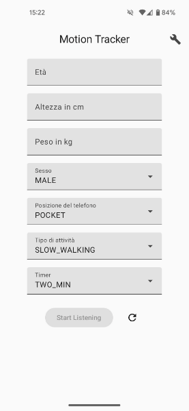
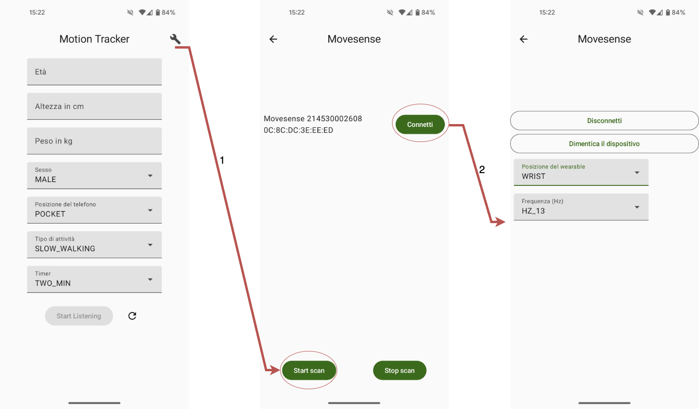
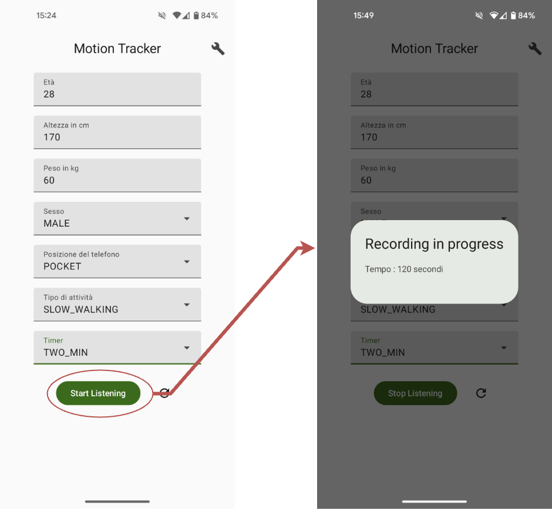

# Motion Tracker

This Android application collects and logs sensor data from the device's **Accelerometer**,
**Gyroscope**, and **Magnetometer** and from a Movesense sensor in real-time. The app can be used
for
applications such as motion analysis, sensor fusion, or any use case where precise sensor data is
needed.

## Features

✅ Real-time data acquisition from the following smartphone sensors:

- Accelerometer (measures acceleration forces)
- Gyroscope (measures device rotation)
- Magnetometer (measures magnetic field strength)

✅ Real-time acquisition of sensor data from Moveseense sensor:

- Accelerometer (measures acceleration forces)
- Gyroscope (measures device rotation)
- Magnetometer (measures magnetic field strength)

✅ Simple user interface to start, stop collecting data.

✅ Data Logging: Save sensor data in CSV format for post-processing.

✅ Store data on Firebase Storage Database for remote access.

## Getting Started

### How to install

1. From the mobile browser go to [releases](https://github.com/ff225/MotionTracker/releases);
2. Download the apk 'app-debug.apk';
3. Allow to install unknown apps from this source;
4. Install.

### How to use the app

The app requires the following permissions:

- **Physical Activity**: Allows the app to track your activity data.
- **Nearby Devices**: Enables pairing with nearby devices like the Movesense sensor.

The app will prompt you for these permissions upon first use. If you deny them initially, you can
enable them later in your device settings.

**Optional:**  
To pair the Movesense sensor with the app, click on the 🔧 button. Here, you can configure the
sensor’s position and data frequency.

Once you've filled in the required fields, start collecting data by clicking the **Start** button.

#### Home page

#### Pair and configure a Movesense sensor

#### Start logging

